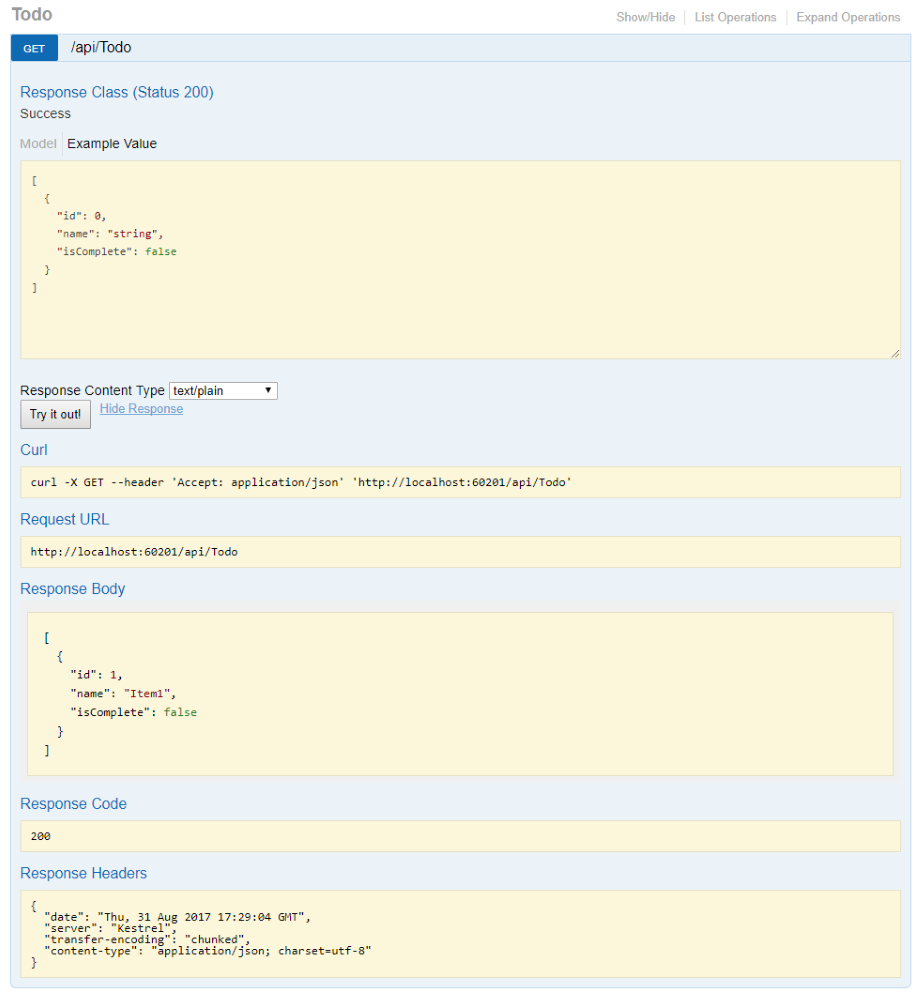
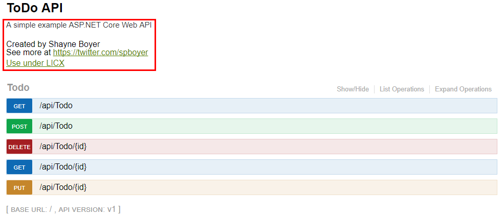
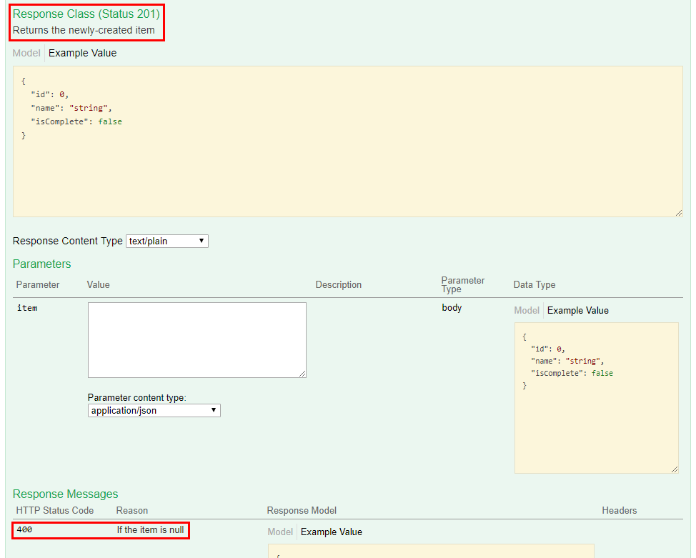
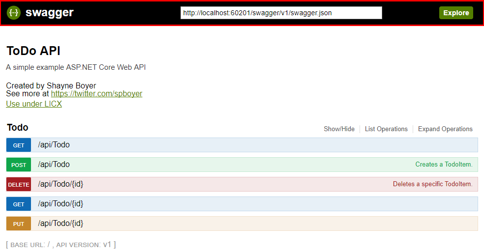

# ASP.NET Web API Help Pages using Swagger

<a name=web-api-help-pages-using-swagger></a>

By [Shayne Boyer](https://twitter.com/spboyer)

Understanding the various methods of an API can be a challenge for a developer when building a consuming application.

Generating good documentation and help pages for your Web API, using [Swagger](http://swagger.io) with the .NET Core implementation [Swashbuckle.AspNetCore](https://github.com/domaindrivendev/Swashbuckle.AspNetCore), is as easy as adding a couple of NuGet packages and modifying the *Startup.cs*.

* [Swashbuckle.AspNetCore](https://github.com/domaindrivendev/Swashbuckle.AspNetCore) is an open source project for generating Swagger documents for ASP.NET Core Web APIs.

* [Swagger](http://swagger.io) is a machine-readable representation of a RESTful API that enables support for interactive documentation, client SDK generation, and discoverability.

This tutorial builds on the sample on [Building Your First Web API with ASP.NET Core MVC and Visual Studio](xref:tutorials/first-web-api). If you'd like to follow along, download the sample at [https://github.com/aspnet/Docs/tree/master/aspnetcore/tutorials/first-web-api/sample](https://github.com/aspnet/Docs/tree/master/aspnetcore/tutorials/first-web-api/sample).

## Getting Started

There are three main components to Swashbuckle:

* `Swashbuckle.AspNetCore.Swagger`: a Swagger object model and middleware to expose `SwaggerDocument` objects as JSON endpoints.

* `Swashbuckle.AspNetCore.SwaggerGen`: a Swagger generator that builds `SwaggerDocument` objects directly from your routes, controllers, and models. It's typically combined with the Swagger endpoint middleware to automatically expose Swagger JSON.

* `Swashbuckle.AspNetCore.SwaggerUI`: an embedded version of the Swagger UI tool which interprets Swagger JSON to build a rich, customizable experience for describing the Web API functionality. It includes built-in test harness capabilities for the public methods.

## NuGet Packages

You can add Swashbuckle with any of the following approaches:

* From the Package Manager Console:

    ```powershell
    Install-Package Swashbuckle.AspNetCore
    ```

* In Visual Studio:

     * Right-click your project in Solution Explorer > Manage NuGet Packages
     * Enter Swashbuckle.AspNetCore in the search box
     * Set the Package source to nuget.org
     * Tap the Swashbuckle.AspNetCore package and then tap Install

## Add and configure Swagger to the middleware

Add the Swagger generator to the services collection in the `ConfigureServices` method of *Startup.cs*:

[!code-csharp[Main](../tutorials/web-api-help-pages-using-swagger/sample/TodoApi/Startup2.cs?name=snippet_ConfigureServices&highlight=7-10)]

In the `Configure` method of *Startup.cs*, enable the middleware for serving the generated JSON document and the SwaggerUI:

[!code-csharp[Main](../tutorials/web-api-help-pages-using-swagger/sample/TodoApi/Startup2.cs?name=snippet_Configure&highlight=4,7-10)]

Press *F5* in Visual Studio to launch the app. Navigate to `http://localhost:<random_port>/swagger/v1/swagger.json` to see the generated document that describes the endpoints.

> [!NOTE]
> Microsoft Edge, Google Chrome, and Firefox display JSON documents natively. There are extensions for Chrome that format the document for easier reading. *The following example is reduced for brevity.*

```json
{
   "swagger": "2.0",
   "info": {
       "version": "v1",
       "title": "API V1"
   },
   "basePath": "/",
   "paths": {
       "/api/Todo": {
       "get": {
           "tags": [
               "Todo"
           ],
           "operationId": "ApiTodoGet",
           "consumes": [],
           "produces": [
               "text/plain",
               "application/json",
               "text/json"
           ],
           "responses": {
           "200": {
               "description": "OK",
               "schema": {
                   "type": "array",
                   "items": {
                       "$ref": "#/definitions/TodoItem"
                   }
               }
           }
        },
        "deprecated": false
       },
       "post": {
           ...
       }
       },
       "/api/Todo/{id}": {
       "get": {
           ...
       },
       "put": {
           ...
       },
       "delete": {
           ...
   },
   "definitions": {
       "TodoItem": {
           "type": "object",
           "properties": {
               "id": {
                   "format": "int64",
                   "type": "integer"
               },
               "name": {
                   "type": "string"
               },
               "isComplete": {
                   "type": "boolean"
               }
           }
       }
   },
   "securityDefinitions": {}
   }
```

This document drives the Swagger UI, which can be viewed by navigating to `http://localhost:<random_port>/swagger`:


Each public method in `TodoController` can be tested from the UI. Tap a method name to expand the section. Add any necessary parameters, and tap "Try it out!".



## Customization & Extensibility

Swagger provides options for documenting the object model and customizing the UI to match your theme.

### API Info and Description

The configuration action passed to the `AddSwaggerGen` method can be used to add information such as the author, license, and description:

[!code-csharp[Main](../tutorials/web-api-help-pages-using-swagger/sample/TodoApi/Startup.cs?range=20-30,36)]

The following image depicts the Swagger UI displaying the version information:



### XML Comments

To enable XML comments, right-click the project in Visual Studio and select **Properties**. Check the **XML Documentation file** box under the **Output Settings** section.


Configure Swagger to use the generated XML file.

> [!NOTE]
> For Linux or non-Windows operating systems, file names and paths can be case sensitive. For example, a *ToDoApi.XML* file would be found on Windows but not CentOS.

[!code-csharp[Main](../tutorials/web-api-help-pages-using-swagger/sample/TodoApi/Startup.cs?name=snippet_ConfigureServices&highlight=20-22)]

In the preceding code, `ApplicationBasePath` gets the base path of the app. The base path is used to locate the XML comments file. *TodoApi.xml* only works for this example, since the name of the generated XML comments file is based on the application name.

Adding the triple-slash comments to the method enhances the Swagger UI by adding the description to the section header:

[!code-csharp[Main](../tutorials/web-api-help-pages-using-swagger/sample/TodoApi/Controllers/TodoController.cs?name=snippet_Delete&highlight=2)]


Note that the UI is driven by the generated JSON file. These comments are in that file as well.

```json
"delete": {
  "tags": [
    "Todo"
  ],
  "summary": "Deletes a specific TodoItem",
  "operationId": "ApiTodoByIdDelete",
  "consumes": [],
  "produces": [],
  "parameters": [
    {
      "name": "id",
      "in": "path",
      "description": "",
      "required": true,
      "type": "string"
    }
  ],
  "responses": {
    "204": {
      "description": "No Content"
    }
  },
  "deprecated": false
}
```

Here is a more robust example, adding `<remarks />` where the content can be just text or adding the JSON or XML object for further documentation of the method.

[!code-csharp[Main](../tutorials/web-api-help-pages-using-swagger/sample/TodoApi/Controllers/TodoController.cs?name=snippet_Create&highlight=4-14)]

Notice the UI enhancements with these additional comments.


### DataAnnotations

You can decorate the API controller with `System.ComponentModel.DataAnnotations` to help drive the Swagger UI components.

Adding the `[Required]` annotation to the `Name` property of the `TodoItem` class changes the ModelSchema information in the UI. `[Produces("application/json")]`, `RegularExpression` validators, and more, further detail the information delivered in the generated page. The more metadata that is in the code, the more descriptive the UI or API help page becomes.

[!code-csharp[Main](../tutorials/web-api-help-pages-using-swagger/sample/TodoApi/Models/TodoItem.cs?highlight=10)]

### Describing Response Types

Consuming developers are most concerned with what is returned &mdash; specifically response types and error codes (if not standard). These are handled in the XML comments and data annotations.

Take the `Create` method for example. It returns only a "201 Created" response, by default. That is, of course, if the item is in fact created, or a "204 No Content" if no data is passed in the POST Body. However, there is no documentation to know that or any other response. That can be fixed by adding the following piece of code:

[!code-csharp[Main](../tutorials/web-api-help-pages-using-swagger/sample/TodoApi/Controllers/TodoController.cs?name=snippet_Create&highlight=17,18,20,21)]



### Customizing the UI

The stock UI is both functional and presentable; however, when building documentation pages for your API, you want it to represent your brand or theme. Accomplishing that task with the Swashbuckle components requires adding the resources to serve static files and then building the folder structure to host those files.

If targeting .NET Framework, add the `Microsoft.AspNetCore.StaticFiles` NuGet package to the project:

```xml
<PackageReference Include="Microsoft.AspNetCore.StaticFiles" Version="2.0.0" />
```

Enable the static files middleware:

[!code-csharp[Main](../tutorials/web-api-help-pages-using-swagger/sample/TodoApi/Startup.cs?name=snippet_Configure&highlight=3)]

Acquire the contents of the *dist* folder, used for the Swagger UI page, from the [Swagger UI GitHub repository](https://github.com/swagger-api/swagger-ui/tree/2.x/dist). Copy the contents of that folder into your *wwwroot/swagger/ui* folder:


Create a *custom.css* file in the *wwwroot/swagger/ui/css* folder. The file should contain the following CSS, which provides a basic header title for the page:

[!code-css[Main](../tutorials/web-api-help-pages-using-swagger/sample/TodoApi/wwwroot/swagger/ui/css/custom.css)]

Reference *custom.css* in the *index.html* file:

[!code-html[Main](../tutorials/web-api-help-pages-using-swagger/sample/TodoApi/wwwroot/swagger/ui/index.html?range=14)]

The resulting page looks as follows:



There is much more you can do with the page. See the full capabilities for the UI resources at the [Swagger UI GitHub repository](https://github.com/swagger-api/swagger-ui).